به نام خدا

تمرین اول مباحث ویژه

رگرسیون خطی چندمتغیره با استفاده از رابطه نرمال و گرادیان کاهشی

استاد دولتشاهی

پریسا مبارک

40211415006

**شرح تمرین:**

یک فایل اکسل داریم. میخواهیم از طریق روش رگرسیون خطی چندمتغیره با استفاده از رابطه نرمال و گرادیان کاهشی، یک مدل آموزش دهیم و سپس آن را predict کنیم یعنی در نهایت یک مجموعه داده unseen به مدل بدهیم و از این طریق میزان کارایی مدلی که آموزش دادیم را بسنجیم.

برای این کار تمام ستون ها به جز ستو آخر را به عنوان ورودی و ستون آخر را به عنوان خروجی و هدف در نظر میگیریم. هم چنین 70 درصد داده ها را به داده های آموزشی و 30 درصد آن را نیز به مجموعه test اختصاص میدهیم.

ابتدا کتابخانه های لازم را import میکنیم:

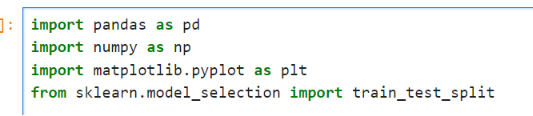

سپس فایل اکسل را خوانده و آن را به ndarray تبدیل میکنیم. و خروجی را مشاهده میکنیم:

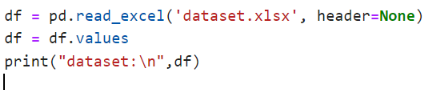

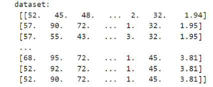

سپس داده های ورودی و خروجی(هدف) و داده های train و test که به ترتیب 70 درصد و 30 درصد از داده ها هستند را مشخص میکنیم:

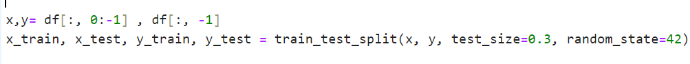

درمرحله بعد توابع مورد نیاز یعنی دو تابع فرضیه و خطا را مینویسیم:

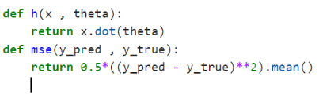

سپس داده های آموزشی را با استفاده از نرمال سازی، نرمال میکنیم:

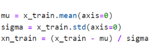

مرحله بعد، پیاده سازی گرادیان کاهشی هست. برای اینکار ابتدا مقادیر اولیه مورد نیاز را برای alpha و tetha مشخص میکنیم. همچنین یک لیست خالی به نام costs\_train نیز ایجاد میکنیم زیرا میخواهیم در هر حله خطایی که محاسبه میشود را در این لیست ذخیره کنیم و در نهایت تغییرات خطا که در این لیست مشخص هست را در نمودار نشان دهیم. بعد از دادن مقادیر اولیه و تعریف لیست خطای آموزشی، تابع گرادیان کاهشی را مینویسم. در این تابع فقط یک گام آپدیت پارامترها(theta ها) انجام میشود. یک مرحله آپدیت پارامترها نیز به این صورت انجام میشود که ابتدا تابع فرضیه (تابع h) را روی داده های آموزشی نرمال شده و پارامترها اعمال میکنیم و خروجی را بدست می آوریم و آن را y\_pred می نامیم. سپس با استفاده از تابع mse خطای خروجی بدست آمده(y\_pred) و خروجی اصلی و واقعی یا هدف(y\_train) را بدست می آوریم و آن را در لیست costs\_train ذخیره میکنیم. سپس پارامترها را هم زمان آپدیت می کنیم. یعنی در حلقه for اول تغییرات را برای هر پارامتر مشخص کرده و در حلقه for دوم این تغییرات را در پارامترها اعمال میکنیم:

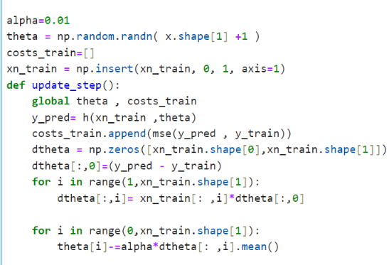

در مرحله بعد prediction انجام میدهیم یعنی یک مجموعه داده unseen یا همان داده های test را به مدل میدهیم و عملکرد مدلمان را میسنجیم. اما چون میخواهم دو نمودار خطای آموزشی و تست را نشان دهم همانند کد زیر ابتدا یک لیست خالی برای داده های تست نیز ایجاد میکنم و بعد در یک حلقه for تابع یک مرحله ای گرادیان کاهشی را فراخوانی میکنم(همانطور که گفتم در این تابع خطای آموزشی در لیست ذخیره میشه) و سپس داده های تست را نرمال سازی کرده و با استفاده از تابع فرضیه(تابع h) خروجی داده های تست را بدست می آوریم(y\_pred\_test). در نهایت خطای این خروجی و خروجی واقعی یا هدف(y\_test) را از طریق تابع mse محاسبه می کنیم و آن را به لیست خطاهای تست اضافه میکنیم. پس این مراحل را در یک حلقه با تعداد تکرار 1000 انجام میدهیم و به این صورت یک لیست از خطاهای آموزشی و یک لیست از خطاهای تست بدست می آوریم:

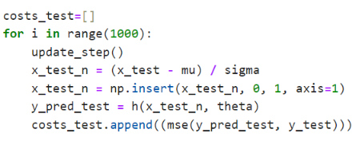

در نهایت از طریق کد زیر دو نمودار خطای آموزشی و خطای تست را رسم میکنیم:

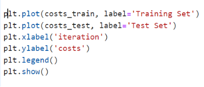

**بخش دوم تمرین اول: رگرسیون خطی با استفاده از رابطه نرمال:**

در ادامه به جای استفاده از گرادیان کاهشی، از رابطه نرمال استفاده میکنیم:

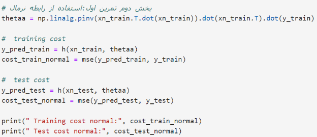

خروجی نهایی به این صورت می شود:

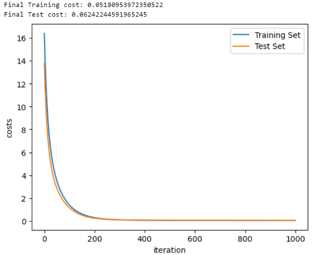

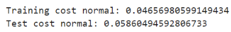

در تصاویر بالا خطاهای آموزش و تست ابتدا برای بخش اول تمرین یعنی رگرسیون خطی با استفاده از گرادیان کاهشی و به همراه نمودارهمگرایی آن ها نمایش داده شده شده است. همچنین در ادامه خطای آموزش و تست برای بخش دوم این تمرین یعنی رگرسیون خطی بااستفاده از رابطه نرمال نشان داده شده است.

